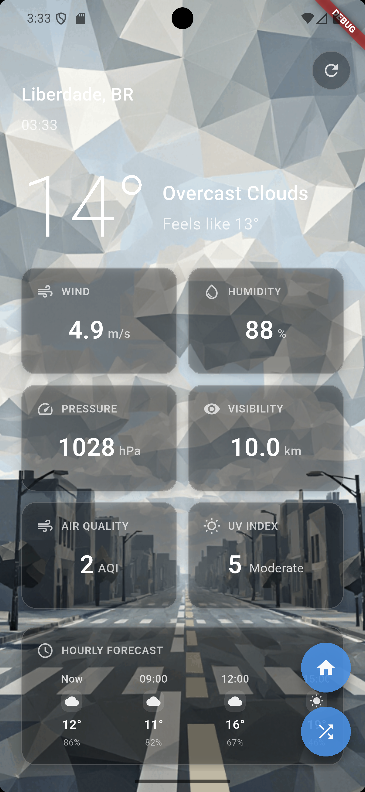

# 🌤️ SkyMesh - Intelligent Location-Based Weather App

**Real-time weather information from anywhere in the world with beautiful low-poly backgrounds**

SkyMesh is a Flutter-based weather application that provides detailed weather information with customized background images tailored to your location and weather conditions.

## 📱 Key Features

### 🎯 Core Features
- **Real-time Location-Based Weather**: Automatic GPS location detection and weather information
- **Global Random City Explorer**: Explore weather from 68 major cities worldwide
- **Intelligent Background Images**: Automatic background image matching based on location and weather conditions
- **30-Minute Auto Refresh**: Automatic weather updates for selected regions

### 📊 Detailed Weather Information
- **Current Weather**: Temperature, feels-like temperature, humidity, wind speed, pressure, visibility
- **Hourly Forecast**: Detailed 24-hour forecast information
- **7-Day Weather Forecast**: Weekly weather trends and high/low temperatures
- **Air Quality Index**: Real-time air quality information (AQI)
- **UV Index**: UV levels and exposure risk assessment

### 📰 Weather News Integration
- **Location-based Weather News**: News articles related to current location's weather
- **Extreme Weather Alerts**: Breaking news about severe weather conditions
- **Climate Change News**: Latest updates on climate and environmental issues
- **Tabbed Interface**: Easy switching between weather data and news content
- **External Links**: Direct access to full news articles via browser

## 🖼️ App Screenshots

<div align="center">
  
  
</div>

<div align="center">
  
  
</div>

## ✨ Special Features

### 🌍 Smart Location Recognition
- **Automatic Location Detection**: Accurate current location tracking via GPS
- **Global Support**: Support for 68 major cities worldwide
- **Offline Resilience**: Stable service with mock data during network errors

### 🎨 Beautiful UI/UX
- **Low-Poly Design**: Modern and minimalist low-poly art style
- **Context-Based Backgrounds**: Backgrounds reflecting location landmarks and weather conditions
- **Smooth Animations**: Natural fade effects during screen transitions and data loading
- **Intuitive Interface**: User-friendly information layout and visual elements

### ⚡ Performance Optimization
- **Efficient Memory Management**: Image caching and proper resource disposal
- **Fast Response Times**: Optimized communication with OpenWeatherMap API
- **Battery Efficiency**: Intelligent background update management

### 🏗️ Clean Architecture
- **SOLID Principles**: Complete adherence to all five SOLID principles
- **Dependency Injection**: Modular dependency management with service locator
- **Interface Segregation**: Small, focused interfaces for better maintainability
- **Strategy Pattern**: Extensible weather data sources without code modification

## 🛠️ Tech Stack

### Framework & Language
- **Flutter 3.8.1+**: Cross-platform mobile development
- **Dart**: High-performance asynchronous programming

### Key Libraries
- **geolocator ^10.1.0**: GPS location services
- **http ^1.1.2**: REST API communication
- **permission_handler ^11.1.0**: System permission management
- **url_launcher ^6.2.5**: External URL launching for news articles

### Architecture Patterns
- **Repository Pattern**: Clean data access abstraction
- **Strategy Pattern**: Pluggable weather data sources
- **Dependency Injection**: Loose coupling and testability
- **Facade Pattern**: Simplified API for complex subsystems

### External APIs
- **OpenWeatherMap API**: Real-time weather data and forecast information
- **NewsAPI**: Weather and climate-related news articles
- **Custom Image Mapping System**: Location-specific background images

## 📁 Project Structure

### Clean Architecture with SOLID Principles

```
lib/
├── main.dart                          # App entry point with DI initialization
├── core/                              # Core business logic (Clean Architecture)
│   ├── interfaces/                    # Abstract interfaces (DIP)
│   │   ├── weather_repository.dart    # Weather data abstraction
│   │   ├── location_service.dart      # Location service interface
│   │   ├── image_service.dart         # Image service interface
│   │   └── weather_interfaces.dart    # ISP-compliant interfaces
│   ├── models/                        # Domain models (SRP)
│   │   ├── weather_data.dart          # Weather data model
│   │   ├── hourly_weather_data.dart   # Hourly forecast model
│   │   ├── weekly_weather_data.dart   # Weekly forecast model
│   │   └── news_data.dart             # News article model
│   ├── strategies/                    # Strategy pattern (OCP)
│   │   └── weather_strategy.dart      # Pluggable weather strategies
│   ├── dependency_injection/          # DI container (DIP)
│   │   ├── service_locator.dart       # Service locator
│   │   └── weather_module.dart        # Module configuration
│   └── tests/                         # Contract tests (LSP)
│       └── weather_repository_test.dart
├── data/                              # Data layer implementations
│   └── services/                      # Concrete implementations
│       ├── openweather_api_service.dart  # OpenWeatherMap API
│       ├── geolocator_service.dart       # GPS location service
│       └── location_image_service_impl.dart # Image service impl
├── services/                          # Facade layer (compatibility)
│   ├── weather_service.dart          # Simplified weather facade
│   ├── location_image_service.dart    # Location-image mapping
│   └── news_service.dart              # News API service
├── widgets/                           # Presentation layer
│   ├── weather_display_widget.dart    # Weather UI components
│   ├── background_image_widget.dart   # Background management
│   └── news_list_widget.dart           # News articles display
├── design_system/                     # UI design system
│   └── design_system.dart            # Colors and themes
└── utils/                             # Utility functions
    └── image_assets.dart              # Asset management
```

## 🚀 Installation and Setup

### Prerequisites
- Flutter SDK 3.8.1 or higher
- Android Studio or VS Code
- Android/iOS development environment setup

### Installation Steps
1. **Clone Repository**
   ```bash
   git clone https://github.com/krindale/sky_mesh.git
   cd sky_mesh
   ```

2. **Install Dependencies**
   ```bash
   flutter pub get
   ```

3. **Run the App**
   ```bash
   flutter run
   ```

### Development Environment
- **Android**: Android 5.0 (API 21) or higher
- **iOS**: iOS 12.0 or higher (future support planned)
- **Permissions**: Location services, Internet connectivity

## 🔧 API Configuration

1. **Get OpenWeatherMap API Key**
   - Sign up at [OpenWeatherMap](https://openweathermap.org/api)
   - Generate API key

2. **Get NewsAPI Key (Optional)**
   - Sign up at [NewsAPI](https://newsapi.org/)
   - Generate API key for news functionality
   - Replace API key in `lib/services/news_service.dart`
   - If no API key provided, sample news data will be displayed

3. **Environment Setup**
   - Replace API key in `lib/data/services/openweather_api_service.dart`
   - Or configure via `WeatherConfigurationService` in dependency injection
   - Development API key is included in this project

## 🏗️ Architecture Details

### SOLID Principles Implementation

#### 1. **Single Responsibility Principle (SRP)**
- Each class has one reason to change
- `WeatherRepository`: Only handles weather data operations
- `LocationService`: Only manages location functionality
- `ImageService`: Only handles image selection logic

#### 2. **Open/Closed Principle (OCP)**
- Open for extension, closed for modification
- Strategy pattern allows adding new weather data sources
- New location services can be added without changing existing code

#### 3. **Liskov Substitution Principle (LSP)**
- All implementations are substitutable for their interfaces
- Contract tests ensure behavioral compatibility
- Mock implementations maintain same contracts

#### 4. **Interface Segregation Principle (ISP)**
- Small, focused interfaces instead of large ones
- `CurrentWeatherService`, `WeatherForecastService`, `RandomWeatherService`
- Clients depend only on methods they actually use

#### 5. **Dependency Inversion Principle (DIP)**
- High-level modules don't depend on low-level modules
- Both depend on abstractions (interfaces)
- Dependency injection manages all dependencies

### Design Patterns Used

- **Repository Pattern**: Clean data access layer
- **Strategy Pattern**: Pluggable weather data sources  
- **Facade Pattern**: Simplified API for UI layer
- **Dependency Injection**: Inversion of control container
- **Factory Pattern**: Weather data object creation

## 📈 Development Roadmap

### Short-term Goals (1-2 months)
- **iOS Platform Support** expansion
- **Multi-language Support** (English, Chinese, Japanese)
- **Widget Features** addition
- **Enhanced News Categorization** with better filtering
- **News Bookmark Feature** for saving important articles

### Medium-term Goals (3-6 months)
- **Weather Notification Service** implementation
- **Personalized Weather Recommendations** feature
- **Social Sharing** functionality

### Long-term Goals (6+ months)
- **AI-based Weather Prediction** enhancement
- **Wearable Device Integration**
- **Cloud Synchronization** services

## 🤝 Contributing

### How to Contribute
1. Fork the repository
2. Create feature branch (`git checkout -b feature/amazing-feature`)
3. Commit changes (`git commit -m 'Add amazing feature'`)
4. Push to branch (`git push origin feature/amazing-feature`)
5. Create Pull Request

### Development Guidelines
- **Code Style**: Follow Flutter/Dart official guidelines
- **SOLID Principles**: Maintain clean architecture principles
- **Testing**: Write unit tests and contract tests for new features
- **Documentation**: Update README and comments when code changes
- **Dependency Injection**: Use service locator for new dependencies

### Code Quality Standards
- **Architecture**: Follow Clean Architecture and SOLID principles
- **Testing**: Minimum 80% code coverage with unit and integration tests
- **Code Review**: All changes must pass architectural review
- **Performance**: Maintain sub-3-second load times and efficient memory usage

## 📝 License

This project is distributed under the MIT License. See [LICENSE](LICENSE) file for details.

## 📞 Contact

**Developer**: krindale  
**Email**: [Contact information to be added]  
**GitHub**: [@krindale](https://github.com/krindale)

---

<div align="center">
  <h3>🌟 Explore weather around the world with SkyMesh! 🌟</h3>
  <p>A special journey combining real-time weather information with beautiful visual experiences</p>
</div>
